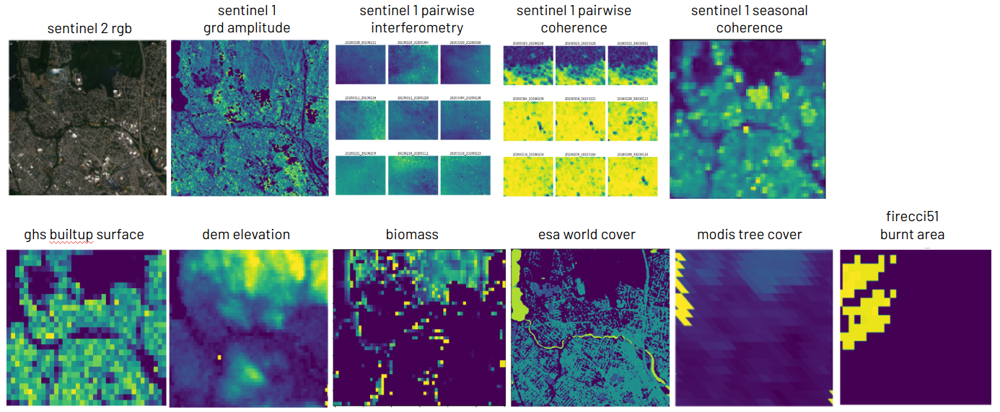
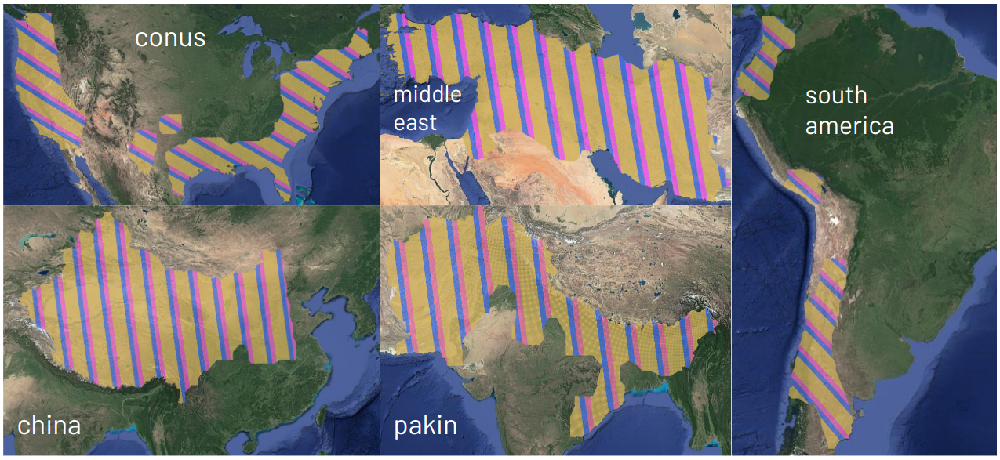
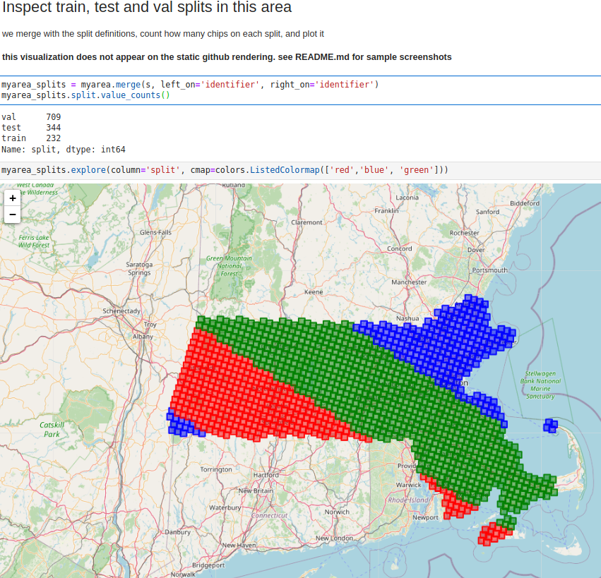
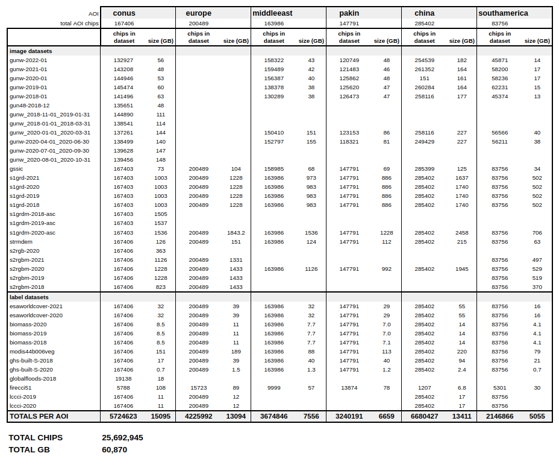

# Earth Observation Datasets

This repository contains information about the multimodal, multilabel, wide area datasets collated during the [2022 ESA-funded Frontier Development Lab](https://fdleurope.org/fdl-europe-2023) project. While the primary aim of the project was to develop generalizable machine learning models for Synthetic Aperture Radar (SAR) data, the resulting datasets can be used for any machine learning application requiring matching tiles of Earth Observation (EO) data and associated labels.

More specifically, the datasets contain co-aligned, tiled chips of EO data. Each chip covers an area of 4480m x 4480m (448x448 pixels at 10m/pixel).

The datasets can be accessed via the Google Cloud Platform: INSERT-LINK-ONCE-READY

## AOIs

The AOIs covered by these datasets cover approximately 10% of the Earth's landmass. 

Each AOI has a `.geojson` file associated with the geometries and ids of every image chip and the predefined train, test and val splits. You can use it to select and download only the chips of a certain dataset or region. For instance, the following illustrates the chips covering Massachusetts.

## Datasets

The following datasets are available

**ARIA Sentinel-1 Geocoded Unwrapped Interferograms**. See https://asf.alaska.edu/data-sets/derived-data-sets/sentinel-1-interferograms/

- `gunw-yyyy-mm`: ARIA Sentinel-1 Geocoded Unwrapped Interferograms on year yyyy and month mm selecting the date within each month that has most interferometric pairs as first date.

- `gunw-dateinit_dateend`: ARIA Sentinel-1 Geocoded Unwrapped Interferograms selecting within the [dateinit, datend] period the date that has most interferometric pairs as first date.

- `gunw48-yyyy-mm`: ARIA Sentinel-1 Geocoded Unwrapped Interferograms on year yyyy and month mm selecting all interferometric pairs at most 48 apart.

**Global Seasonal Sentinel-1 Interferometric Coherence and Backscatter Dataset**

- `gssic`: Global Seasonal Sentinel-1 Interferometric Coherence and Backscatter Dataset 2020. See https://asf.alaska.edu/datasets/derived/global-seasonal-sentinel-1-interferometric-coherence-and-backscatter-dataset/

**Sentinel 1 GRD**

- `s1grd-yyyy`: Sentinel-1 SAR GRD: C-band Synthetic Aperture Radar Ground Range Detected, three channels (vv, vh, vv/vh) taking the seasonal median (4 on a year) on both ascending and descending modes. See https://developers.google.com/earth-engine/datasets/catalog/COPERNICUS_S1_GRD

- `s1grdm-yyyy-asc`: Sentinel 1 SAR GRD: C-band Synthetic Aperture Radar Ground Range Detected, three channels (vv, vh, vv/vh) taking the monthly meedian on ascending passes. See https://developers.google.com/earth-engine/datasets/catalog/COPERNICUS_S1_GRD

**Sentinel 2 RGB**

- `s2rgb-yyyy`: Harmonized Sentinel-2 Level 2A, three channels (red, green, blue) seasonal cloudless median (4 on a year). See https://developers.google.com/earth-engine/datasets/catalog/COPERNICUS_S2_SR_HARMONIZED

- `s2rgbm-yyyy`: Harmonized Sentinel-2 Level 2A, three channels (red, green, blue) monthly cloudless median. See https://developers.google.com/earth-engine/datasets/catalog/COPERNICUS_S2_SR_HARMONIZED

**Digital Elevation Model**

- `strmdem`: NASA SRTM DEM 30m resolution, from https://developers.google.com/earth-engine/datasets/catalog/CGIAR_SRTM90_V4

**Labels datasets**
- `biomass-yyyy`: ESA CCI Above Ground Biomass for year yyyy. See https://climate.esa.int/en/projects/biomass/

- `firecci51`: ESA CCI Burned Area Pixel Product version 5.1. See https://developers.google.com/earth-engine/datasets/catalog/ESA_CCI_FireCCI_5_1

- `lcci-yyyy`: ESA CCI LandCover for year yyyy. See https://www.esa-landcover-cci.org/

- `esaworldcover-2020`: ESA WorldCover v100, from https://developers.google.com/earth-engine/datasets/catalog/ESA_WorldCover_v100

- `esaworldcover-2021`: ESA WorldCover v200, from https://developers.google.com/earth-engine/datasets/catalog/ESA_WorldCover_v200

- `modis44b006veg`: MODIS Vegetation Continuous Field Yearly Global 250m. See https://developers.google.com/earth-engine/datasets/catalog/MODIS_006_MOD44B

- `ghsl-built-S-yyyy`: EU JRC Global Human Settlement Layer, Builtup Surface for year yyyy. See https://ghsl.jrc.ec.europa.eu/download.php?ds=bu

- `globalfloods-2018`: Global Flood Database v1, for year 2018. See https://developers.google.com/earth-engine/datasets/catalog/GLOBAL_FLOOD_DB_MODIS_EVENTS_V1

## Example notebooks

- `01 - inspect chip definitions.ipynb` to download and understand the chip definition `.geojson`
- `02 - download chips from gcp bucket` to select a region and download the chips from that region on the datasets of your selection
- `03 - inspect and visualize datasets` to open downloaded image chips, understand their channels and metadata structure and visualize them.

## Requirements

The datasets can be accessed via the Google Cloud Platform (GCP). Therefore, a working GCP account with `gsutils` installed locally is needed.
